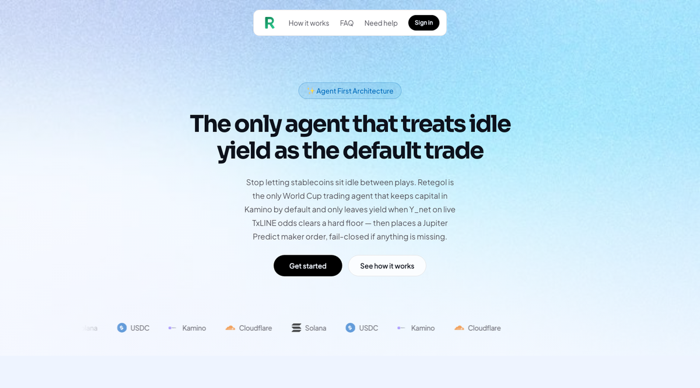

# Retegol

### The only agent that keeps capital in yield until Y_net clears.



Retegol is the **only** World Cup trading agent that keeps USDC in **Kamino**
by default and only leaves yield when **Y_net** on live **TxLINE** odds clears
a hard floor — then places a **Jupiter Predict** maker order. Fail-closed
**HOLD**, no fabricated fills. Not “odds moved, so trade.” No human in the
loop after deploy.

**[Open the live app → retegol.vercel.app](https://retegol.vercel.app)** ·
[Agent health](https://retegol-bot.zanbuilds.workers.dev/health) ·
[Technical documentation](./TECH.md)

Built for the **TxODDS Superteam Earn** hackathon — *Trading Tools and Agents*.

---

## One agent. One loop. Real TxLINE data — never fabricated fills.

Prediction tools often demo with mock odds or fake balances. Retegol does not.
Missing credentials or an empty odds interval produce an honest **HOLD** with a
specific reason on the dashboard. Dry-run decisions still run on **live** odds
when capital is not yet deployed — they are never stored as a real vault balance.

| What the agent does | What it will not do |
| :--- | :--- |
| Poll TxLINE fixtures + per-fixture odds every minute | Invent odds, order IDs, or Kamino balances |
| Flag sharp odds moves (>3% between real snapshots) | Trade when Y_net does not clear `minEdge` |
| Require on-chain TxLINE verify before any TRADE | Trade an unverified fixture |
| Safe-abort if Kamino withdraw or Jupiter order fails | Leave capital mid-path without a recovery attempt |

---

## How it works

**1 — Real data in.** TxLINE fixtures and odds (guest JWT + activated API token).
World Cup fixtures power the Watching panel; each tick pulls per-fixture
snapshots and optional on-chain Merkle verification.

**2 — Decide under a hard bar.** Workers AI (Llama 3) proposes TRADE/HOLD.
Deterministic math in `src/agent/math.ts` enforces:

```text
Y_net ≈ C · makerMargin − C · yieldApy · (eventHorizonHours / yearHours)
TRADE only when yNet / C ≥ minEdge
```

Policy lives in code (`AGENT_POLICY` in `src/agent/config.ts`) — not in env vars.

**3 — Execute or hold.** On TRADE: withdraw from Kamino → place Jupiter Predict
maker. On failure: abort and redeposit if capital already left yield. On HOLD:
capital stays earning.

**4 — Show the loop.** Dashboard (Astro + React on Vercel) streams fixtures,
odds, movement, and agent activity from the Worker API.

---

## For developers

### Repo layout

```text
src/              Cloudflare Worker — agent loop, TxLINE, Kamino, Jupiter, auth
web/              Astro + React dashboard + marketing site (Vercel)
migrations/       Neon PostgreSQL schema
packages/         Optional @retegol/agent SDK / MCP
docs/             TxLINE notes
scripts/          TxLINE activation + ops helpers
```

### Run locally

```bash
pnpm install && cd web && pnpm install && cd ..
cp .dev.vars.example .dev.vars   # fill secrets
echo 'PUBLIC_AGENT_URL=http://127.0.0.1:8787' > web/.env

pnpm dev                         # Worker API → http://127.0.0.1:8787
cd web && pnpm dev               # UI → http://127.0.0.1:4321
```

Apply SQL in `migrations/` to Neon manually.

### Deploy

```bash
# Worker
npx wrangler deploy              # retegol-bot

# Frontend (from web/)
cd web
# PUBLIC_AGENT_URL=https://retegol-bot.zanbuilds.workers.dev
npx vercel --prod
```

- **OAuth callback:** `https://retegol-bot.zanbuilds.workers.dev/auth/google/callback`
- **CORS / return_to:** `FRONTEND_URL` in `wrangler.toml` (includes `https://retegol.vercel.app`)
- **Secrets:** `wrangler secret put …` — see `.dev.vars.example`

### Quick smoke checks

```bash
curl -sS https://retegol-bot.zanbuilds.workers.dev/health | jq .
# Dashboard: sign in → Watching + Live actions (agent runs autonomously)
```

---

## Links

| | |
|---|---|
| **App** | https://retegol.vercel.app |
| **Agent API** | https://retegol-bot.zanbuilds.workers.dev |
| **Health** | https://retegol-bot.zanbuilds.workers.dev/health |
| **Submission paste** | [SUBMISSION.md](./SUBMISSION.md) |
| **Tech deep-dive** | [TECH.md](./TECH.md) |

## Disclaimer

Hackathon demo only — not financial advice, not an endorsement of gambling.
You are responsible for compliance in your jurisdiction.
